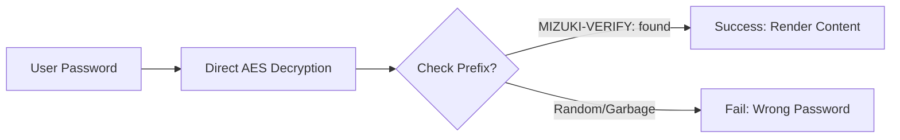

这个博客模板使用 [Astro](https://astro.build/) 构建。本指南没有涉及的内容，可以在 [Astro 文档](https://docs.astro.build/)中查找答案。

## 文章的 Frontmatter

```yaml
---
title: My First Blog Post
published: 2023-09-09
description: This is the first post of my new Astro blog.
image: ./cover.jpg
tags: [Foo, Bar]
category: Front-end
draft: false
---
```


| 属性          | 说明                                                                                                                                                                                                        |
|---------------|-------------------------------------------------------------------------------------------------------------------------------------------------------------------------------------------------------------|
| `title`       | 文章标题。                                                                                                                                                                                                  |
| `published`   | 文章发布日期。                                                                                                                                                                                              |
| `pinned`      | 是否将文章置顶显示在文章列表中。                                                                                                                                                                            |
| `description` | 文章的简短说明，会显示在首页上。                                                                                                                                                                            |
| `image`       | 文章封面图片路径。<br/>1. 以 `http://` 或 `https://` 开头：使用网络图片<br/>2. 以 `/` 开头：使用 `public` 目录中的图片<br/>3. 不含上述前缀：路径相对于 Markdown 文件 |
| `tags`        | 文章标签。                                                                                                                                                                                                  |
| `category`    | 文章分类。                                                                                                                                                                                                  |
| `alias`       | 文章的别名。文章可以通过 `/posts/{alias}/` 访问。例如：`my-special-article`（可通过 `/posts/my-special-article/` 访问）。                                                                                    |
| `licenseName` | 文章内容所用的许可协议名称。                                                                                                                                                                                |
| `author`      | 文章作者。                                                                                                                                                                                                  |
| `sourceLink`  | 文章内容的来源链接或参考资料。                                                                                                                                                                              |
| `draft`       | 文章是否仍为草稿；草稿不会显示。                                                                                                                                                                            |
| `encrypted`   | 文章是否受密码保护。                                                                                                                                                                                        |
| `password`    | 用于解锁加密文章的密码。                                                                                                                                                                                    |
| `passwordHint`| 帮助用户回忆密码的提示，会显示在密码输入框下方。                                                                                                                                                            |

## 文章文件的存放位置


文章文件应放在 `src/content/posts/` 目录中。也可以创建子目录，以便更好地整理文章与资源文件。

```
src/content/posts/
├── post-1.md
└── post-2/
    ├── cover.png
    └── index.md
```

## 文章别名

可以在 Frontmatter 中添加 `alias` 字段，为任意文章设置别名：

```yaml
---
title: My Special Article
published: 2024-01-15
alias: "my-special-article"
tags: ["Example"]
category: "Technology"
---
```

设置别名后：
- 可以通过自定义 URL 访问文章（例如 `/posts/my-special-article/`）
- 默认的 `/posts/{slug}/` URL 仍然有效
- RSS/Atom 订阅源将使用自定义别名
- 所有内部链接都会自动使用自定义别名

**重要说明：**
- 别名中不应包含 `/posts/` 前缀（系统会自动添加）
- 避免在别名中使用特殊字符和空格
- 为获得更好的 SEO 效果，请使用小写字母和连字符
- 确保每篇文章的别名都唯一
- 不要包含开头或结尾的斜杠


## 工作原理



## 页面加密

在 Frontmatter 中设置 `encrypted: true` 并提供 `password`，即可使用密码保护任意文章：

```yaml
---
title: My Private Post
published: 2024-01-15
encrypted: true
password: "my-secret-password"
passwordHint: "Hint: The password is my dog's name"
---
```

### 字段

| 字段           | 必填     | 说明                                                     |
|----------------|----------|----------------------------------------------------------|
| `encrypted`    | 是       | 设置为 `true` 以启用密码保护                             |
| `password`     | 是       | 用于解锁文章的密码                                       |
| `passwordHint` | 否       | 显示在密码输入框下方、用于帮助用户回忆密码的提示         |

### 解锁框的外观

解锁框会显示：
- 使用主题主色的锁形图标
- 文章标题“密码保护”
- 提示用户输入密码的说明
- 密码提示（如果提供了 `passwordHint`）
- 密码输入框和解锁按钮

输入正确密码后，内容会被解密并显示。密码会保存在会话存储中，因此在同一会话内后续加载页面时，用户无需再次输入密码。
