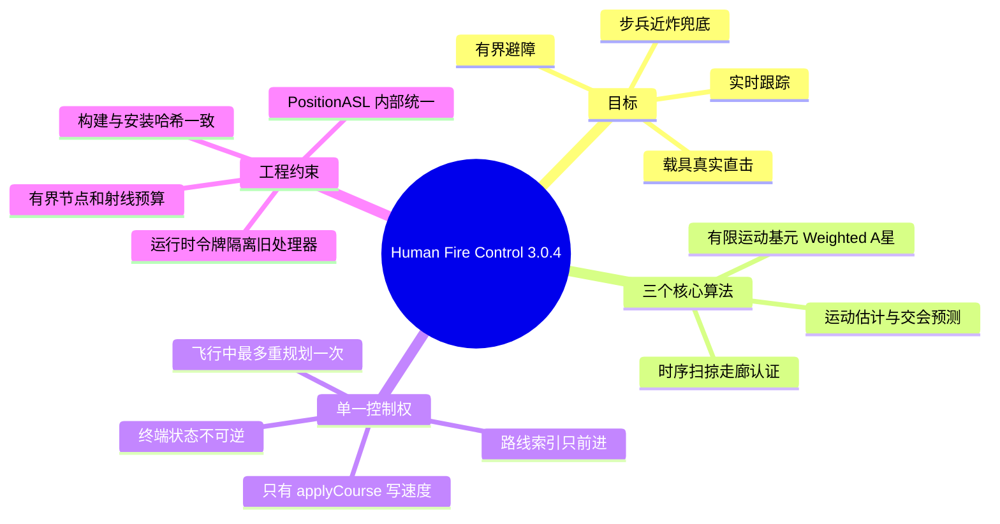
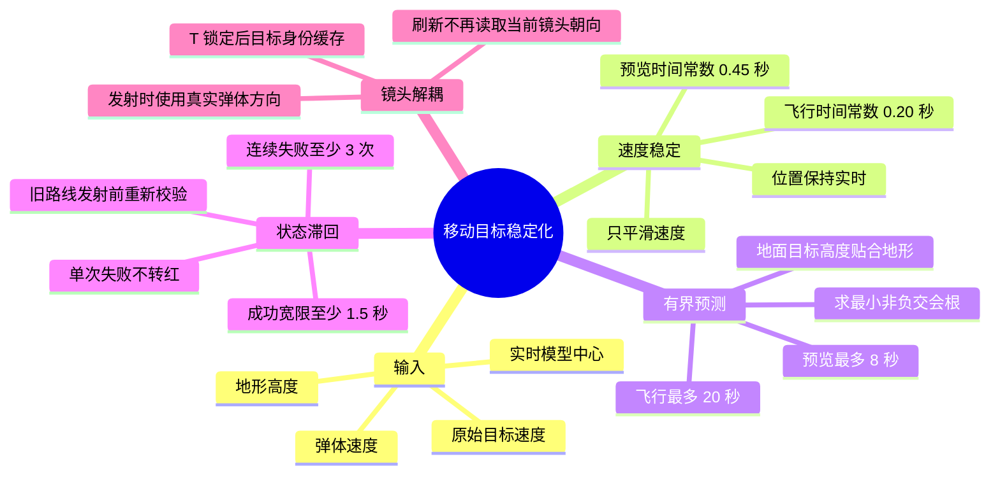
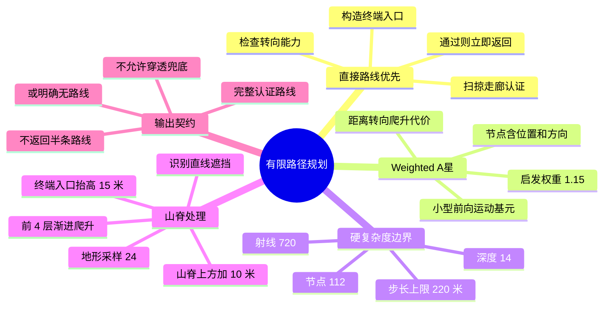
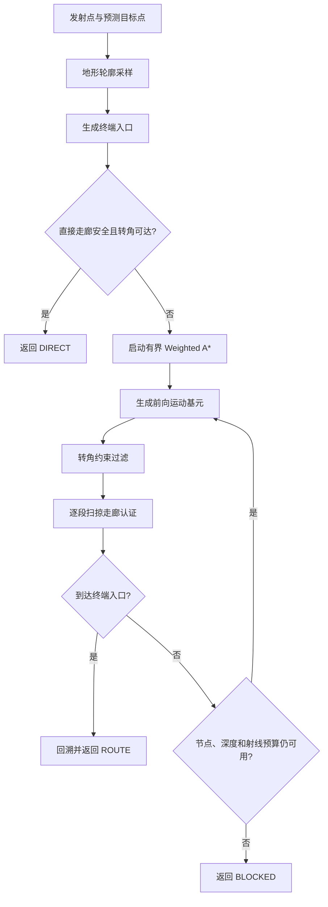
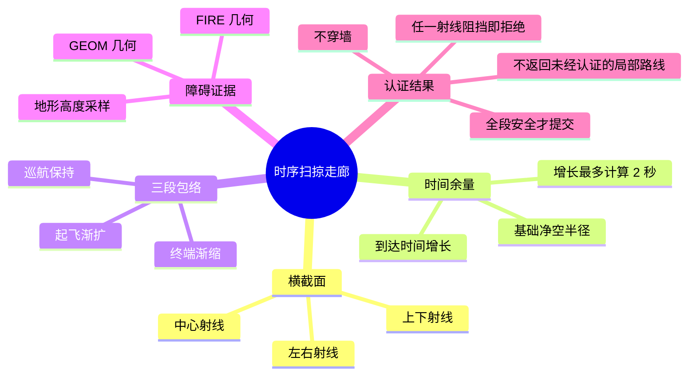
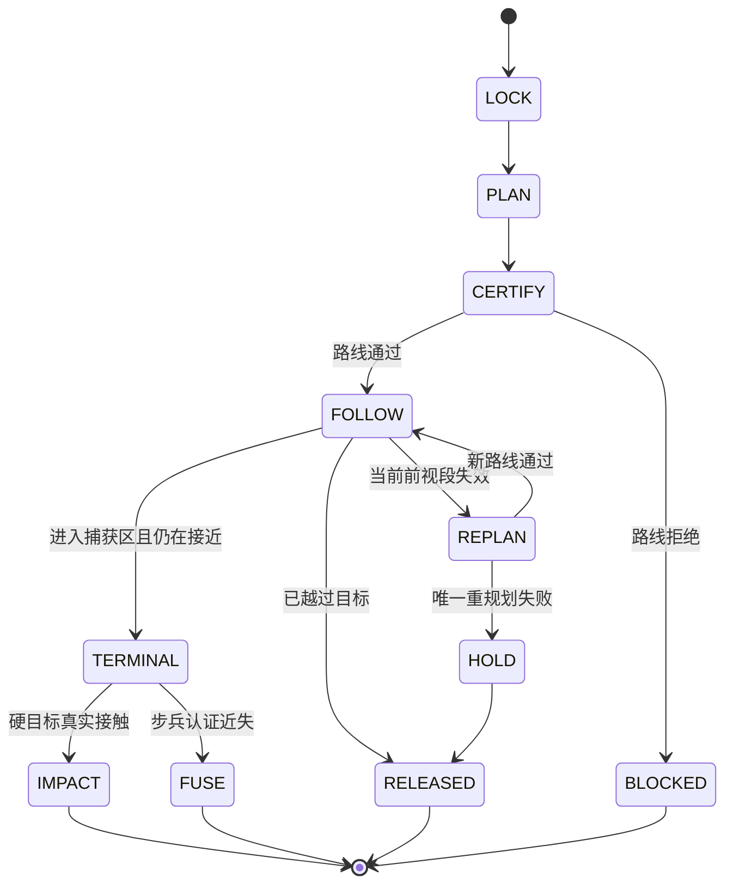
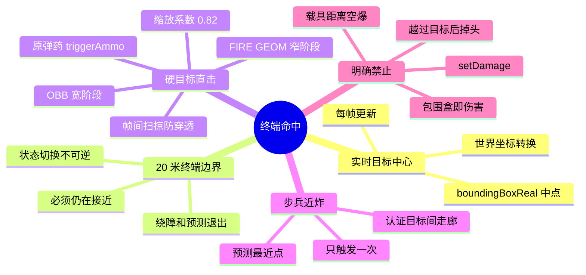
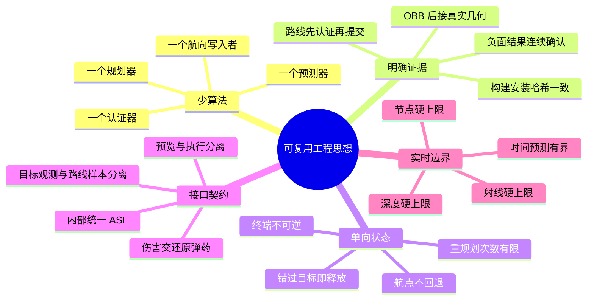

:::note
本文记录一个 Arma 3 智能火控模组从“多算法互相补救”转向“少量核心算法、明确状态边界、逐段安全认证”的重构过程。最终系统只保留三个核心算法族，其余能力全部降级为有界参数或一次性辅助策略。
:::

## 📚 目录

- [摘要]
- [一、从失败现象反推系统边界](#一从失败现象反推系统边界)
- [二、核心算法一：稳定的移动目标预测](#二核心算法一稳定的移动目标预测)
- [三、核心算法二：有限运动基元 Weighted A\*](#三核心算法二有限运动基元-weighted-a)
- [四、核心算法三：时序扫掠走廊认证](#四核心算法三时序扫掠走廊认证)
- [五、单一执行器与单向状态机](#五单一执行器与单向状态机)
- [六、终端命中：碰撞体积只能做宽阶段](#六终端命中碰撞体积只能做宽阶段)
- [七、几个决定稳定性的工程思想](#七几个决定稳定性的工程思想)
- [八、问题与对应修复](#八问题与对应修复)
- [九、当前关键参数](#九当前关键参数)
- [十、代码责任分布](#十代码责任分布)
- [十一、验证方法](#十一验证方法)
- [结语：最优路径不等于最复杂路径](#结语最优路径不等于最复杂路径)

## 摘要

Human Fire Control 的目标看似简单：锁定目标，接管玩家发射的弹体，绕开地形和障碍物，最终命中目标中心。

真正困难的不是让弹体“朝目标转弯”，而是同时满足下面几项约束：

- 目标可能高速移动、转向或跨越起伏地形；
- 弹体必须遵守有限转向能力，不能瞬间改变航向；
- 路线不能撞地、穿墙或在障碍物附近反复左右选边；
- 载具需要真实直击，不能用过大的近炸范围伪装命中；
- SQF 每帧预算有限，不能照搬 ROS、ESDF、QP、MPC 等完整无人机技术栈；
- 锁定、预规划、发射、飞行和终端碰撞必须使用一致的数据与坐标语义。

3.0 重构没有继续叠加算法，而是建立了一个单向、可验证的制导链：

```text
LOCK -> PREDICT -> PLAN -> CERTIFY -> FOLLOW -> TERMINAL -> IMPACT / FUSE
```

:::important
这次重构的重点不是寻找一个“万能算法”，而是让预测、规划、认证和执行各自只有一个明确责任，并让状态只能单向推进。
:::

最终保留的三个核心算法是：

1. **低通运动估计 + 有界恒速交会预测**；
2. **有限运动基元 Weighted A\***；
3. **时序扫掠走廊认证**。

终端碰撞、状态滞回、地形抬升、一次重规划等都只是围绕这三者工作的工程边界，而不是新的竞争算法。

---

## 一、从失败现象反推系统边界

旧版最明显的问题并不是某个公式写错，而是多个模块对“谁拥有最终决定权”没有共识：

- 一个控制器追预测点，另一个控制器追路径点；
- 路线规划失败后，备用算法立即从另一侧重新找路；
- 目标进入终端范围后，预测、避障和吸附仍同时修改航向；
- 单次射线失败就把目标标记为不可达；
- 包围盒、近炸半径和真实模型碰撞之间没有严格区分。

结果就是典型的控制竞争：撞地、蛇形摆动、路线红绿闪烁、越过目标后掉头，以及看似命中但没有对载具造成有效伤害。

### 重构思想总览



这张图的核心不是“功能多”，而是每个功能都有唯一责任人：预测只提供目标点，规划只提供候选路线，认证只回答路线是否安全，执行器才有权修改弹体方向。

---

## 二、核心算法一：稳定的移动目标预测

### 2.1 恒速交会解

设弹体当前位置为 $p_m$，目标位置为 $p_t$，目标速度为 $v_t$，弹体速度标量为 $s_m$。相对位置为：

$$
r = p_t - p_m
$$

要求弹体和目标在时间 $t$ 后相遇：

$$
\lVert r + v_t t \rVert = s_m t
$$

展开后得到二次方程：

$$
(v_t \cdot v_t - s_m^2)t^2 + 2(r \cdot v_t)t + r \cdot r = 0
$$

系统选择不超过预测上限的最小非负根，再计算预测目标点：

$$
p_{goal} = p_t + v_t t
$$

锁定预览的预测上限是 **8 秒**，飞行阶段的最大交会时间是 **20 秒**。预览不使用过长时间外推，因为越远的预测并不一定更聪明，反而更容易把一次短暂转向放大成几百米的目标点跳变。

### 2.2 为什么不能直接使用瞬时速度

Arma 3 中的 `velocity _target` 会包含：

- 车辆悬挂和坡面带来的垂直速度波动；
- AI 转向时的瞬时航向变化；
- 多人环境中的同步抖动；
- 帧间物理更新噪声。

如果把这些值直接乘以数秒交会时间，预测点会在障碍物两侧跳动，路线认证就会在红色和绿色之间快速翻转。

3.0.4 使用一阶低通估计：

$$
\alpha = \frac{\Delta t}{\tau + \Delta t}
$$

$$
\hat v_k = \hat v_{k-1} + \alpha(v_k - \hat v_{k-1})
$$

- 锁定预览时间常数 $\tau = 0.45$ 秒；
- 飞行制导时间常数 $\tau = 0.20$ 秒；
- 位置始终采用实时值，只平滑速度，因此不会把目标位置“拖在后面”。

对于步兵和地面载具，预测点的高度不是简单沿当前 Z 速度外推，而是保持目标中心相对地面的高度：

$$
z_{goal}=h_{terrain}(x_{goal},y_{goal})+h_{centre}
$$

这样可以避免车辆经过坡面时把未来目标点预测到地下或高空。

### 2.3 连续失败滞回

安全路线是一个二值结果，但现实观测带有噪声。单次失败只能说明“这一帧的候选路线没有通过”，不能立即证明目标彻底不可达。

当前状态只有在同时满足以下条件时才会由安全转为红色：

- 连续规划失败至少 **3 次**；
- 距离上一次成功认证至少 **1.5 秒**。

偶发失败期间继续显示上一次已认证状态，但并不会把旧路线伪装成新路线：系统分别保存“最后观测位置”和“最后路线认证位置”。发射时如果认证样本已经过期，仍然会以弹体真实位置和目标当前状态重新规划。

### 移动目标稳定化思维导图



---

## 三、核心算法二：有限运动基元 Weighted A\*

### 3.1 为什么不用完整无人机规划栈

AutoChaser、SANDO、Fast-Planner、EGO-Planner/EGO-Swarm 和 trajectory_optimization 展示了许多值得借鉴的思想，例如预测目标运动、限制轨迹动力学、局部重规划和碰撞约束。

但 Arma 3 模组没有 ROS 图、持久 ESDF、GPU 优化器或稳定的连续梯度环境。直接移植完整方法会产生大量桥接代码和不可控的每帧开销。因此本项目只吸收它们共同体现的工程原则：

- 搜索空间必须有界；
- 轨迹必须服从转向能力；
- 候选路线和安全认证分离；
- 动态变化优先局部修正，而不是无限重算全局最优解。

### 3.2 先直达，再搜索

规划器首先检查从发射点到终端入口的直接扫掠走廊。只有直接路线被障碍物阻挡时，才打开 Weighted A\* 搜索。

每个节点只包含：

```text
位置、前进方向、父节点、累计代价、深度、加权评分
```

评分函数为：

$$
f(n)=g(n)+w\,h(n)
$$

当前启发权重 $w=1.15$。累计代价由航程、转向角和爬升量组成：

$$
g_{new}=g+distance+0.08\cdot turnAngle+0.35\cdot climb
$$

每个节点只生成一个固定的小型前向运动基元集合：保持、左右、上下和少量斜向组合。候选方向如果超过弹体在该段飞行时间内允许的转角，就在碰撞检测前直接淘汰。

### 3.3 自适应步长与硬预算

固定 18 米步长在 3 公里范围内无法覆盖完整路线，因此步长会根据剩余距离和剩余深度自适应增长：

```text
requiredStep = remainingDistance / remainingDepth
```

同时保留硬上限：

- 最大节点数：**112**；
- 最大射线检查数：**720**；
- 最大搜索深度：**14**；
- 最大单步长度：**220 米**；
- 最大运动基元转角：**24 度**；
- 飞行中最多重新规划：**1 次**。

这些值不是性能建议，而是算法终止条件。无论场景多复杂，搜索都不会无限扩张。

### 3.4 背坡目标与山脊抬升

只做三维射线并不足以处理背坡目标。目标越近时，直线入射角反而可能更低，更容易被山脊截断，这正是“远处有路线、近处反而无路线”的来源。

地面目标规划会沿发射点到预测目标点采样 **24 个**地形位置：

1. 检查直线是否被地形轮廓遮挡；
2. 记录最高山脊高度；
3. 将巡航抬升下限设置为山脊高度加 **10 米**；
4. 在前 **4 个**搜索深度内逐步爬升；
5. 终端入口至少保持在目标中心上方 **15 米**，随后再俯冲到模型中心。

这不是重新引入一套“山地算法”，而是给同一个运动基元规划器增加一个可证明、可限制的高度下界。

### 路径规划思维导图



### 规划流程图



---

## 四、核心算法三：时序扫掠走廊认证

### 4.1 从“中心射线”升级为“弹体走廊”

只检查路径中心线会漏掉弹体半径、制导误差和障碍物边缘。每一段候选路径因此同时检查五类射线：

- 中心；
- 左、右；
- 上、下。

安全半径还会随预计到达时间小幅增长：

$$
r_{safe}=r_{clearance}+0.2\cdot\min(t,2)
$$

这使远端路线拥有略大的误差余量，但增长被限制在两秒窗口内，不会让长距离路线因为包络无限膨胀而全部失败。

### 4.2 起飞、巡航和终端使用不同包络

弹体刚离开枪口时近似为一个点。如果一开始就强制完整安全半径，肩射武器的下方射线很容易落入地面，造成“所有目标都无安全路线”。

当前走廊分为三个阶段：

1. **起飞渐扩**：由枪口附近的小半径逐渐扩大；
2. **巡航保持**：使用完整安全半径；
3. **终端渐缩**：接近目标时逐渐缩小到目标中心，允许真实命中。

几何检测使用 `lineIntersectsSurfaces` 的 `FIRE/GEOM` 层，并补充地形高度采样。目标、发射平台和当前弹体在对应阶段被明确排除，避免把合法起点或目标模型当成中途障碍物。

### 走廊认证思维导图



---

## 五、单一执行器与单向状态机

优秀的路径如果被多个控制器同时执行，仍然会变成蛇形轨迹。3.0 的关键工程约束是：

- 只有 `HFC_fnc_applyCourse` 可以调用 `setVelocity`；
- 每枚弹体只有一个 HashMap 状态记录；
- 航点索引只能增加，不能退回旧航点；
- 进入 `TERMINAL` 后永不回到 `FOLLOW`；
- 弹体越过捕获区后释放控制，不执行 180 度掉头；
- 路线失效时最多重新规划一次，失败后保持当前前进方向。



这种单向状态机牺牲了“无限补救”的幻想，却从结构上消除了左右反复选边和越过目标后掉头的问题。

---

## 六、终端命中：碰撞体积只能做宽阶段

### 6.1 为什么不能直接用包围盒判定命中

载具的 `boundingBoxReal` 很适合快速判断弹体是否可能穿过目标体积，但它包含模型周围的空白区域。如果弹体一进入包围盒就直接引爆，结果仍然是另一种形式的空爆。

因此硬目标采用两阶段碰撞：

1. **宽阶段 OBB**：把目标局部包围盒缩放为 `0.82`，用弹体上一帧到当前帧的扫掠线段检查是否穿过定向包围体；
2. **窄阶段 FIRE/GEOM**：只有宽阶段命中后，才用真实模型几何面确认接触位置。

窄阶段确认后，系统把原弹体校正到真实接触点并调用 `triggerAmmo`。它不使用 `setDamage`，伤害仍由原始弹药和 Arma 3 引擎计算。

### 6.2 终端中心捕获

目标中心来自 `2 boundingBoxReal` 的几何边界中点，再转换到世界坐标。进入终端区后，规划与预测永久退出，弹体逐帧指向目标实时模型中心。

普通终端距离为 **20 米**。对于高速直击弹药，提前捕获距离还会参考：

$$
d_{capture}=\min(100,\max(20,0.22\cdot speed))
$$

这个距离只决定何时开始稳定追踪目标中心，不代表碰撞或爆炸半径。最终伤害仍要求真实几何接触。

### 6.3 近炸只属于步兵目标

- `CAManBase`：允许经过走廊认证的一次性近炸；
- 车辆、飞机和舰船：禁用距离近炸，必须走直击碰撞链；
- 近炸只触发原弹药，不脚本写入伤害；
- 已经错过目标后不允许多次重定向和多次引爆。

### 终端碰撞思维导图



---

## 七、几个决定稳定性的工程思想

### 7.1 预览状态不等于执行许可

HUD 可以在短暂噪声期间保持上一次已认证颜色，但发射路径不能直接相信这个颜色。系统分别保存：

- `targetSample`：最后一次目标观测位置；
- `routeSample`：当前路线真正通过认证时的目标位置。

如果两者偏差超过阈值，发射事件会重新规划。这样既消除了 UI 抖动，也没有通过“永远显示绿色”掩盖安全问题。

### 7.2 坐标系必须成为接口契约

内部目标中心、路线节点、地形采样、碰撞射线和弹体状态统一使用 `PositionASL`。只有调用原生 `setMissileTargetPos` 时才执行 `ASLToATL`。

坐标转换不再散落在算法内部，因此很难再次出现“屏幕看到的位置正确，但射线和弹体使用另一高度基准”的问题。

### 7.3 负面证据需要时间确认

一次“无路线”可能来自目标速度尖峰、物理帧顺序或临界射线。安全系统不应忽略失败，但也不应把一次失败当成永久事实。

正面证据可以立即提交；负面证据需要连续次数和持续时间共同确认。这种非对称滞回不仅适用于火控，也适用于网络状态、传感器目标、服务健康检查和实时 UI。

### 7.4 宽阶段与窄阶段必须分工

包围盒负责快速排除“不可能接触”，真实模型面负责确认“确实接触”。把宽阶段直接当成伤害判定，性能会很好，但语义一定错误。

### 7.5 复杂度上限是算法的一部分

节点数、射线数、搜索深度和重规划次数不是事后优化开关，而是规划器正确性的一部分。实时系统除了回答“能否找到路线”，还必须回答“最坏情况下多久停止”。

### 工程思想思维导图



---

## 八、问题与对应修复

| 旧现象 | 根因 | 3.0.4 方法 |
|---|---|---|
| 大量目标显示无安全路线 | 起飞阶段立即使用完整走廊半径 | 起飞渐扩、巡航保持、终端渐缩 |
| 锁定后移开镜头，弹体飞向远方 | 路线刷新重新依赖镜头方向 | 锁定目标缓存；预览与镜头解耦；发射读取真实弹体方向 |
| 障碍物后目标红黄/红绿闪烁 | 单帧规划结果直接覆盖状态 | 速度低通、8 秒预览上限、3 次/1.5 秒失败滞回 |
| 远距离背坡可行，近距离反而不可行 | 近距离直线入射角更低，山脊挡住终端段 | 地形轮廓采样、山脊上方抬升和高位终端入口 |
| 载具上方空爆 | 近炸和宽包围体被用于硬目标 | 非步兵禁用近炸；OBB 宽阶段后必须通过 FIRE/GEOM 窄阶段 |
| 0–800 米显示直达却打不中 | 高速弹体一帧跨过目标或过晚进入终端 | 基于弹速的提前捕获、帧间扫掠和真实碰撞修复 |
| 弹体空中左右摇摆 | 多个控制器和重复重规划竞争 | 单一速度写入者、单向航点索引、最多一次重规划 |

---

## 九、当前关键参数

| 参数 | 默认值 | 含义 |
|---|---:|---|
| `HFC_lockDistance` | 3000 m | 最大搜索/锁定距离 |
| `HFC_lockPredictionHorizon` | 8 s | 锁定预览预测上限 |
| `HFC_maximumInterceptTime` | 20 s | 飞行交会预测上限 |
| `HFC_maximumGuidanceTime` | 45 s | 单枚弹体最长接管时间 |
| `HFC_lockVelocityTimeConstant` | 0.45 s | 锁定预览速度低通时间常数 |
| `HFC_guidanceVelocityTimeConstant` | 0.20 s | 飞行制导速度低通时间常数 |
| `HFC_lockBlockedFailureThreshold` | 3 | 进入红色前的连续失败次数 |
| `HFC_lockBlockedGraceTime` | 1.5 s | 上次成功后的失败宽限期 |
| `HFC_plannerMaximumNodes` | 112 | 单次规划最大节点数 |
| `HFC_plannerMaximumRayChecks` | 720 | 单次规划最大射线检查数 |
| `HFC_plannerMaximumDepth` | 14 | 搜索最大深度 |
| `HFC_plannerMaximumStep` | 220 m | 自适应基元最大步长 |
| `HFC_plannerTerrainSamples` | 24 | 地形轮廓采样数 |
| `HFC_plannerLoftMargin` | 10 m | 山脊上方巡航余量 |
| `HFC_terminalLoftHeight` | 15 m | 遮挡路线终端入口抬升 |
| `HFC_terminalDistance` | 20 m | 不可逆终端中心跟踪距离 |
| `HFC_maximumReplans` | 1 | 飞行中最大重规划次数 |
| `HFC_directImpactVolumeScale` | 0.82 | 硬目标 OBB 宽阶段缩放 |
| `HFC_directImpactForecastTime` | 0.08 s | 高速碰撞前视时间 |

参数的目的不是提供无限调参空间，而是明确算法边界。通常应先定位输入、状态或坐标语义问题，再考虑修改这些默认值。

---

## 十、代码责任分布

| 文件 | 单一职责 |
|---|---|
| `fn_prepareLockPlan.sqf` | 锁定预览、速度低通、预测与状态滞回 |
| `fn_predictIntercept.sqf` / `fn_solveIntercept.sqf` | 有界恒速交会解 |
| `fn_planRoute.sqf` | 直接路线、山脊抬升与有限运动基元 Weighted A\* |
| `fn_certifySegment.sqf` | 五射线时序扫掠走廊与地形认证 |
| `fn_updateProjectiles.sqf` | 单向航点执行、终端状态和碰撞链 |
| `fn_segmentIntersectsBox.sqf` | OBB 宽阶段线段相交 |
| `fn_targetGeometry.sqf` | 实时模型中心、半径和局部半尺寸 |
| `fn_applyCourse.sqf` | 唯一弹体速度写入边界 |
| `fn_preInit.sqf` / `fn_startRuntime.sqf` / `fn_initialize.sqf` | 读档安全的运行时生命周期 |

---

## 十一、验证方法

本项目没有继承旧版庞大的测试栈，而是保留轻量、决定性的验证：

- **17 项静态契约**：函数注册、复杂度上限、唯一速度写入者、坐标边界、移动目标滞回、碰撞语义等；
- **9 项纯 SQF 算法检查**：交会解、不可达根、转向限制、运动基元边界、线段与目标体积相交；
- **HEMTT 构建检查**：32 个 SQF 函数全部编译；
- **安装一致性**：构建 PBO 与游戏目录 PBO 比较 SHA-256。

3.0.4 的已验证 PBO SHA-256 为：

```text
A1596CD2FFB9A6B41EA6627755CF81FF3D4C30A9B31482366BEC4A229ACBF8AC
```

真实游戏复测重点不是随机发射大量弹药，而是逐项改变一个变量：

1. 同一静止目标，分别测试直达、建筑后和背坡；
2. 同一路线，只改变目标速度；
3. 锁定后移开镜头，确认路线状态不受镜头影响；
4. 对步兵验证一次性近炸，对车辆验证真实直击；
5. 对 0–800 米目标验证帧间扫掠，对 1–3 公里目标验证地形抬升。

---

## 结语：最优路径不等于最复杂路径

这次重构最重要的收获不是某个 A\* 权重或低通参数，而是下面这条工程判断：

> 实时制导系统首先需要唯一控制权、单向状态和可验证边界，然后才需要更聪明的路径。

当预测器、规划器、认证器和执行器各自只回答一个问题时，很多“算法不够先进”的表象会自然消失。系统不再依靠更多备用算法互相补救，而是依靠：

- 有界预测；
- 有界搜索；
- 全段认证；
- 单一执行；
- 真实碰撞；
- 可复现验证。

这套方法并不局限于 Arma 3。任何资源受限、观测带噪声、需要实时避障和终端命中的系统，都可以复用同样的设计原则：**把复杂性集中在清晰边界内，而不是分散到一条永远结束不了的回退链里。**
